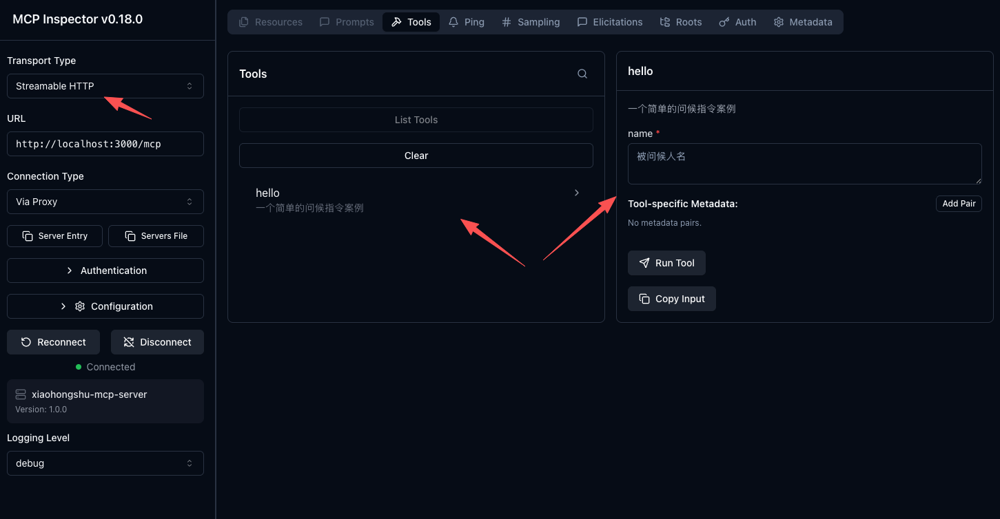

# 🦀 拆解 xiaohongshu-mcp

> 拆解 https://github.com/xpzouying/xiaohongshu-mcp 并用 nodejs 重构 🤿

```
帮我写一篇帖子发布到小红书上，
配图为：https://cn.bing.com/th?id=OHR.MaoriRock_EN-US6499689741_UHD.jpg&w=3840
图片是：“纽西兰陶波湖的Ngatoroirangi矿湾毛利岩雕（© Joppi/Getty Images）"

使用 xiaohongshu-mcp 进行发布。
```
AI Agent 只负责“想清楚要做什么”，但不能直接“动手操作网页”，是 MCP 提供了这样的能力。

## 🍕 场景一：“使用 xiaohongshu-mcp 进行 xxx”

claude 是如何知道 xiaohongshu-mcp 这个特定名称的东西呢？

1️⃣ 首先，启动本express项目：
```bash
# node v20 拉取依赖
npm i

# 启动 localhost:3000 express 服务
npm start
```

2️⃣ 使用 claude mcp 注册即可

```bash
# 添加 HTTP MCP 服务器
claude mcp add --transport http xiaohongshu-mcp http://localhost:3000/mcp

# 检查 MCP 是否添加成功（确保 MCP 已经启动的前提下，运行下面命令）
claude mcp list
```

iflow 版本

```bash
# SSE
iflow mcp add --transport sse xiaohongshu-mcp http://localhost:3000/mcp

# Streamable HTTP
iflow mcp add --transport http xiaohongshu-mcp http://localhost:3000/mcp

# 列出所有MCP服务器
iflow mcp list
```

### 🚧 什么是 MCP Inspector

调试工具，用于测试 MCP 连接：

```bash
# 启动 MCP Inspector
npx @modelcontextprotocol/inspector

# 在浏览器中连接到：http://localhost:3000/mcp
```

MCP Transport Type 一共有 3 种：

- STDIO
- <del>SSE</del> [已弃用](https://zhuanlan.zhihu.com/p/1941887870429292241)
- Streamable HTTP

STDIO 和 SSE、Streamable HTTP 是什么区别？

| STDIO | SSE               | Streamable HTTP    |
| ----- | ----------------- | ------------------ |
| /     | `app.get("/mcp")` | `app.post("/mcp")` |

#### 🧷 Streamable HTTP 最小案例并通过 `@modelcontextprotocol/inspector` 测试：

 - Streamable HTTP 官方案例：[simpleStreamableHttp.ts](https://github.com/modelcontextprotocol/typescript-sdk/blob/main/examples/server/src/simpleStreamableHttp.ts)
 - 本项目固定写法来自：[mcp-streamable-http-typescript-server](https://github.com/ferrants/mcp-streamable-http-typescript-server)
 - 最小案例代码 [demo.js](./assets/demo.js)
 - inspector 测试截图 ⬇️
   

<br/>
<br/>
<br/>

## 🔐 场景二：检查小红书登录状态

如何检查小红书登录状态？

作者通过打开浏览器 https://www.xiaohongshu.com/explore 页面查看指定 DOM 来判断是否登录；

⚠️ 这种方式需要下载 无头浏览器（约 150MB）实现，包括后续也是通过操作 DOM 的方式发布作品。

原仓库用了 `github.com/xpzouying/headless_browser` 工具，nodejs 可以用 `playwright` 或者 `puppeteer`。

> 题外话：如果是自己内部网页，可以用 OAuth + api 的方式进行
>
> OAuth 的实现过程： terminal open 一个带 token 的链接，本地监听 auth callback。
> 用户在浏览器通过这个链接登录成功后，terminal 的 auth callback 会把登录信息返回，
> 这样就实现了无需无头浏览器的 OAuth

```js
// npm install playwright
// npx playwright install chromium
// npm install playwright
import { chromium } from "playwright";

export async function checkLoginStatus() {
  // 启动浏览器
  const browser = await chromium.launchPersistentContext(
    ".chromiumTemp", // 将浏览器数据存储在当前目录下
    {
      headless: false, // 显示浏览器，便于调试
    }
  );
  const page = await browser.newPage();

  await page.goto("https://www.xiaohongshu.com/explore", { waitUntil: "load" });

  try {
    // 轮训 等待登录中...
    const loginElement = await page.waitForSelector(
      ".main-container .user .link-wrapper .channel",
      { timeout: 0 }
    );

    if (!loginElement) {
      await browser.close();
      throw new Error("login status element not found");
    }

    await browser.close();
    return true;
  } catch (err) {
    await browser.close();
    throw new Error("login status element not found");
  }
}

// 注册 check_login_status 指令
server.registerTool(
  "check_login_status",
  {
    title: "检查小红书登录状态",
    description: "检查小红书登录状态",
  },
  async () => {
    await server.sendLoggingMessage({
      level: "info",
      data: `等待登录中...`,
    });
    const loginStatus = await checkLoginStatus();
    if (!loginStatus) {
      return {
        content: [
          {
            type: "text",
            text: `用户未登录`,
          },
        ],
      };
    }
    isLoggedIn = true;
    return {
      content: [
        {
          type: "text",
          text: `用户已登录, 登录状态: ${loginStatus}`,
        },
      ],
    };
  }
);
```

## 📝 场景三：发布内容的 prompt 配置

如何内置 prompt 在 mcp 中？

```js
import { z } from "zod";
// prompt
const PublishContentArgsSchema = z.object({
  title: z
    .string()
    .describe("内容标题（小红书限制：最多20个中文字或英文单词）"),

  content: z
    .string()
    .describe(
      "正文内容，不包含以#开头的标签内容，所有话题标签都用tags参数来生成和提供即可。"
    ),

  images: z
    .array(z.string())
    .min(1)
    .describe(
      "图片路径列表（至少需要1张图片）。支持两种方式：1. HTTP/HTTPS图片链接（自动下载）；2. 本地图片绝对路径"
    ),

  tags: z
    .array(z.string())
    .optional()
    .describe(
      "话题标签列表（可选参数），如 [#美食, #旅行, #生活]，最多3个，最少1个`"
    ),
});

// 配置在 publish_content 指令的 inputSchema 中
server.registerTool(
  "publish_content",
  {
    title: "发布内容到小红书",
    description: "发布内容到小红书",
    inputSchema: PublishContentArgsSchema,
  },
  async ({ title, content, images, tags }) => {
    if (!isLoggedIn) {
      return {
        content: [
          {
            type: "text",
            text: "请先登录",
          },
        ],
      };
    }
    await publishContent(title, content, images, tags);
    return {
      content: [
        {
          type: "text",
          text: `发布成功: ${title} ${content} ${tags}`,
        },
      ],
    };
  }
);
```
